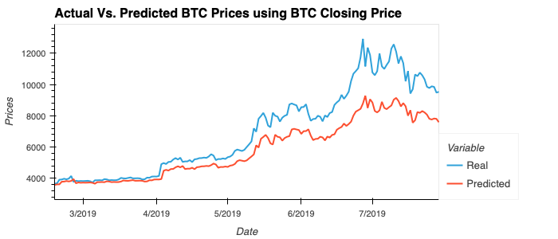
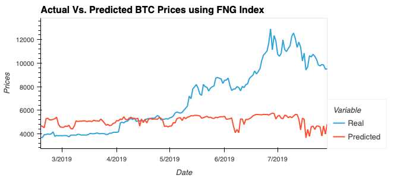

# LSTM Stock Predictor

Due to the volatility of cryptocurrency speculation, investors will often try to incorporate sentiment from social media and news articles to help guide their trading strategies. One such indicator is the [Crypto Fear and Greed Index (FNG)](https://alternative.me/crypto/fear-and-greed-index/) which attempts to use a variety of data sources to produce a daily FNG value for cryptocurrency. 

This document builds and evaluates deep learning models using both the FNG values and simple closing prices to determine if the FNG indicator provides a better signal for cryptocurrencies than the normal closing price data.

In this assignment, I have used deep learning recurrent neural networks to model bitcoin closing prices. One model will use the FNG indicators to predict the closing price while the second model will use a window of closing prices to predict the nth closing price.

- - -

### Files

[Closing Prices Notebook](lstm_stock_predictor_closing.ipynb)

[FNG Notebook](lstm_stock_predictor_fng.ipynb)

- - -

### Conclusion

Which model has a lower loss?
>LSTM Stock Predictor Using Closing Prices has a lower loss.

>Loss basis Closing Prices is 0.0335 and the Loss basis Fear and Greed Index is 0.1556

Which model tracks the actual values better over time?
>LSTM Stock Predictor Using Closing Prices tracks the actual values better over time.

>Below is the comparison of actual and predicted values under each model

>Actual vs Predicted values basis the Closing Prices Model

>Actual vs Predicted values basis the Fear and Greed Index Model

Which window size works best for the model?
>Window size of 1 day works best for the model as the loss is the lowest. 
>With Window size of 1 day the loss basis Closing Prices is 0.0335 and the Loss basis Fear and Greed Index is 0.1556

>With Window size of 10 days the Loss basis Closing Prices is 0.0886 and the Loss basis Fear and Greed Index is 0.3022

- - -

### Resources

[Keras Sequential Model Guide](https://keras.io/getting-started/sequential-model-guide/)

[Illustrated Guide to LSTMs](https://towardsdatascience.com/illustrated-guide-to-lstms-and-gru-s-a-step-by-step-explanation-44e9eb85bf21)

[Stanford's RNN Cheatsheet](https://stanford.edu/~shervine/teaching/cs-230/cheatsheet-recurrent-neural-networks)

- - -

